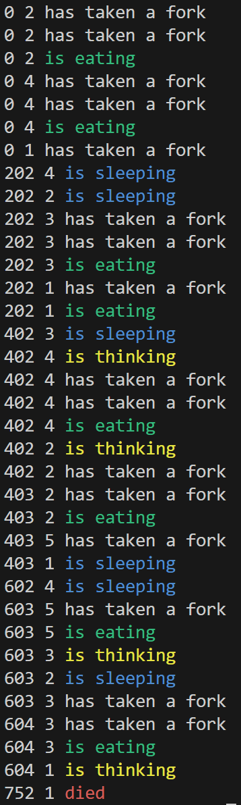

# 🍝 Philosophers




A classic concurrency problem dealing with synchronization, mutexes, and semaphores. The goal is to manage a group of philosophers who alternate between eating, thinking, and sleeping without starving.

## 🧠 The Problem

One or more philosophers sit at a round table.
*   The philosophers alternatively **eat**, **think**, or **sleep**.
*   There are as many forks as there are philosophers.
*   To eat, a philosopher needs **two forks** (left and right).
*   Simulation stops if a philosopher dies of starvation or if all philosophers have eaten the specified number of times (if argument is provided).

## 🛠️ Implementation

### Mandatory (`philo`)
*   **Threads** & **Mutexes**: Each philosopher is a thread. Forks are protected by mutexes to prevent data races.
*   **One process**: Everything runs in a single process.

### Bonus (`philo_bonus`)
*   **Processes** & **Semaphores**: Each philosopher is a separate process. Forks are represented by a centralized semaphore.
*   **Parent/Child**: Synchronization is handled via semaphores across processes.

## 🚀 Usage

### Compilation
Navigate to the respective directory and compile:

```bash
# Mandatory
cd philo
make

# Bonus
cd philo_bonus
make
```

### Execution
The program takes the following arguments:
`./philo [number_of_philosophers] [time_to_die] [time_to_eat] [time_to_sleep] [number_of_times_each_philosopher_must_eat (optional)]`

**Examples:**

```bash
# 5 Philosophers, 800ms to die, 200ms to eat, 200ms to sleep
./philo 5 800 200 200

# Simulation should stop (philosopher dies)
./philo 4 310 200 100

# 5 Philosophers, run 7 times each (simulation stops successfully)
./philo 5 800 200 200 7
```
